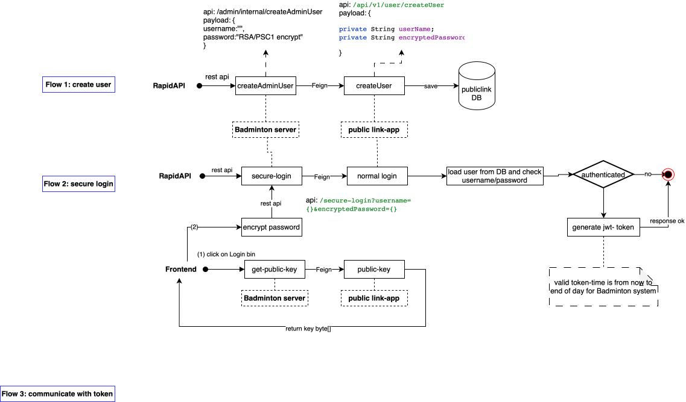

# Key gen command
# Generate private key
openssl genrsa -out private.pem 2048

# Extract public key
openssl rsa -in private.pem -pubout -out public.pem

3) https - feign api
   Step A: Create the Root CA (The Trust Anchor)
   # Generate the CA Private Key
   openssl genrsa -out rootCA.key 4096
   # Generate the Root Certificate (Valid for 10 years)
   openssl req -x509 -new -nodes -key rootCA.key -sha256 -days 3650 -out rootCA.crt

   Step B: Generate Badminton Server Keys
   # Create Key & CSR (Certificate Signing Request)
   openssl genrsa -out bad20260227.key 2048
   openssl req -new -key bad20260227.key -out badminton.csr
   # Sign with Root CA
   openssl x509 -req -in badminton.csr -CA rootCA.crt -CAkey rootCA.key -CAcreateserial -out badminton.crt -days 365 -sha256
   # Pack into PKCS12 (Java KeyStore format)
   openssl pkcs12 -export -in badminton.crt -inkey bad20260227.key -out badminton.p12 -name "badminton"

   Step C: Generate Authorization Server Keys
   Repeat Step B, but replace "badminton" with "auth-server".

   Step D: Create the Truststore
   This file tells the servers to trust anyone signed by your rootCA.crt.
   keytool -import -file rootCA.crt -alias myCA -keystore truststore.jks

20260228: complete the microservice authentication.
    Flows: 

    